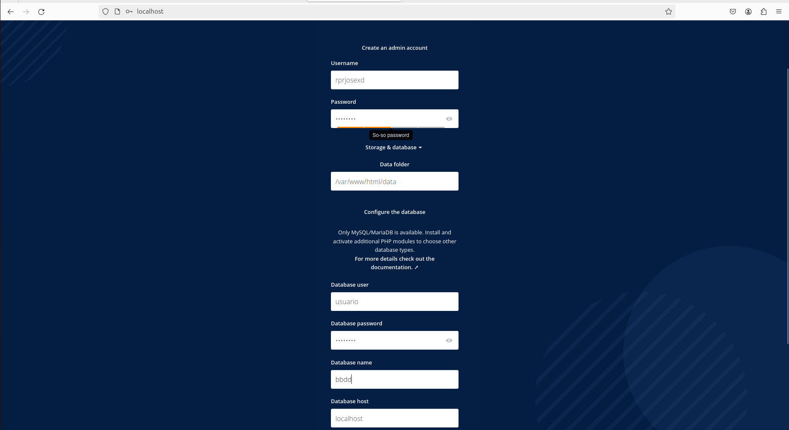
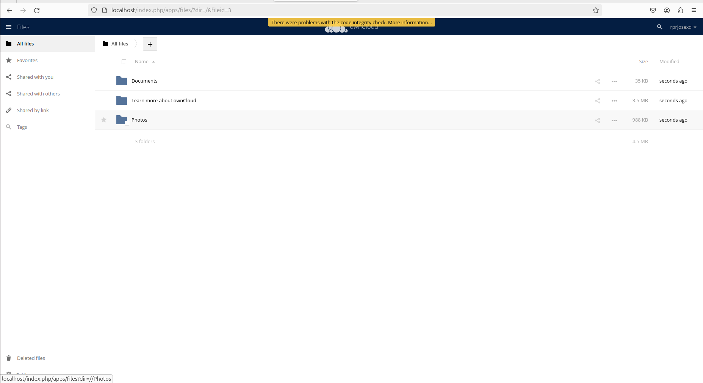
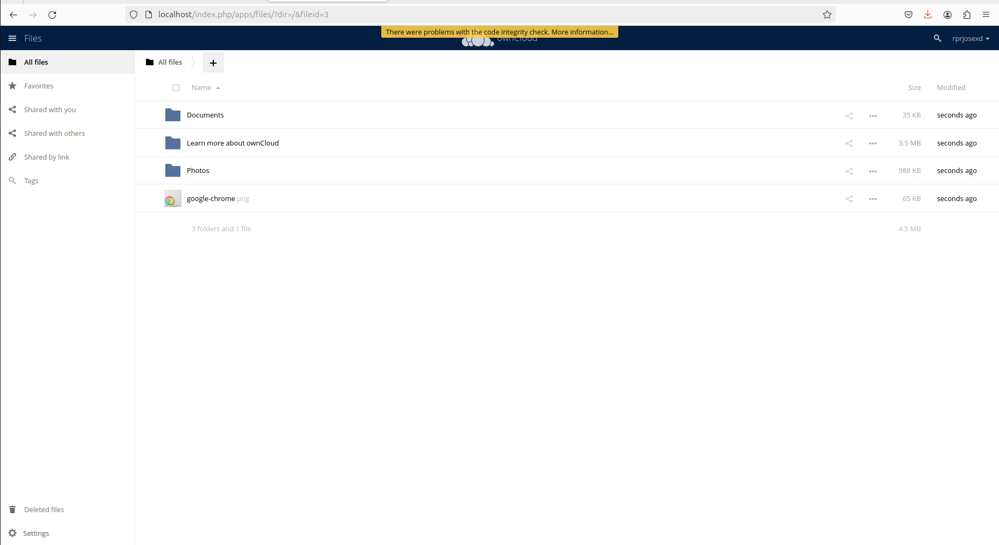
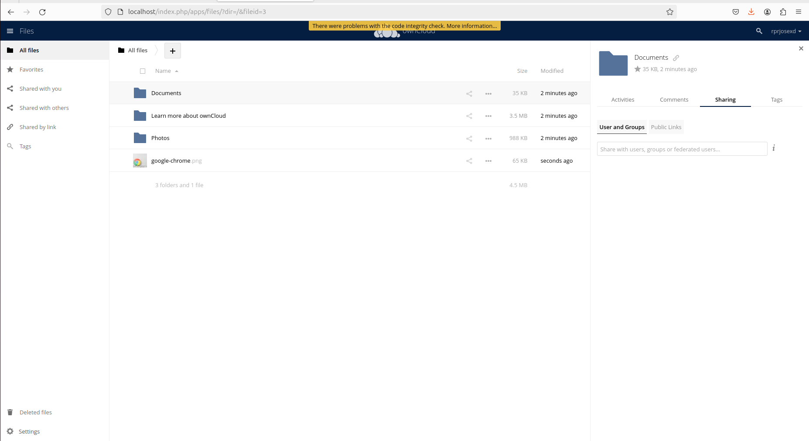
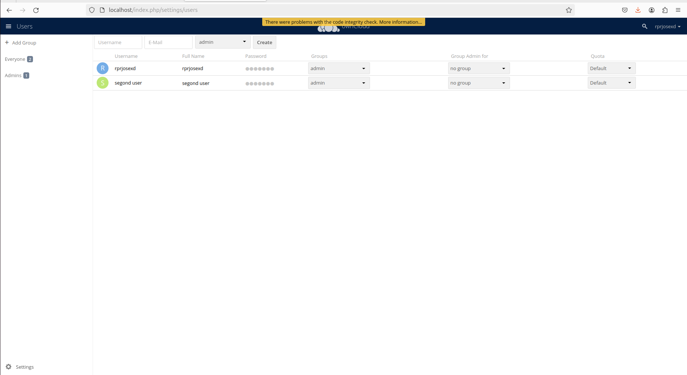
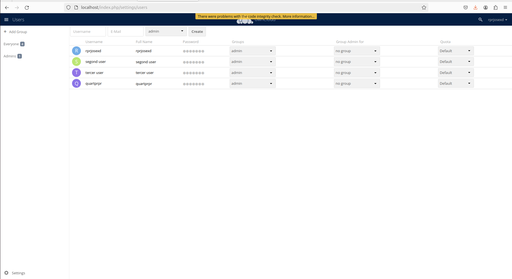

# CONFIGURATION.md

## Configuració d’ownCloud

Aquest document detalla la configuració d’usuaris, rols, permisos i administració d’arxius a ownCloud, un cop instal·lat el sistema.

---

### 👥 1. Creació d’usuaris

S’han creat tres usuaris amb diferents rols per simular un entorn col·laboratiu:

- **admin** – Administrador del sistema
- **editor1** – Pot modificar i pujar arxius
- **viewer1** – Només pot visualitzar contingut

---

### 🔐 2. Assignació de rols i permisos

A cada usuari se li han assignat permisos específics:

- **admin**: control total
- **editor1**: accés d’escriptura en certes carpetes
- **viewer1**: només lectura

---

### 📂 3. Gestió de carpetes i arxius

S’han creat carpetes i pujat arxius per verificar el correcte funcionament de la plataforma.

---

### 🧪 4. Proves de funcionalitat

Cada usuari accedeix a les carpetes segons els permisos establerts:

- **editor1** pot pujar i editar arxius.
- **viewer1** pot veure'ls però no modificar-los.

---

### 🔗 5. Compartició de contingut

S’han compartit fitxers amb altres usuaris i s’han configurat opcions com:

- Caducitat dels enllaços
- Permisos de compartició
- Compartir amb o sense edició

recuperacion
---

### 🛡️ 6. Polítiques de seguretat

Es configuren funcions addicionals com la caducitat automàtica dels enllaços compartits i opcions de seguretat per als arxius.

---

### 🌐 7. Accés remot des d’una altra màquina

S’ha provat l’accés a ownCloud des d’un altre dispositiu de la xarxa per verificar la funcionalitat remota.

---

## ✅ Conclusió

Amb aquesta configuració, ownCloud queda preparat per a la gestió col·laborativa de fitxers amb control d’accés, seguretat i funcionalitat completa entre diferents usuaris.
